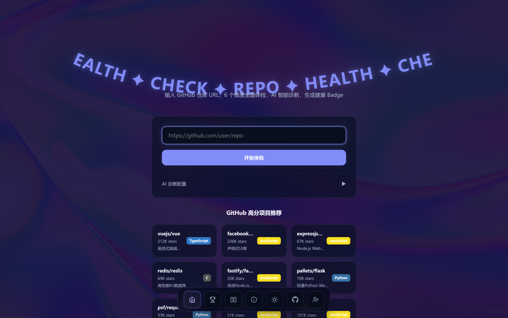
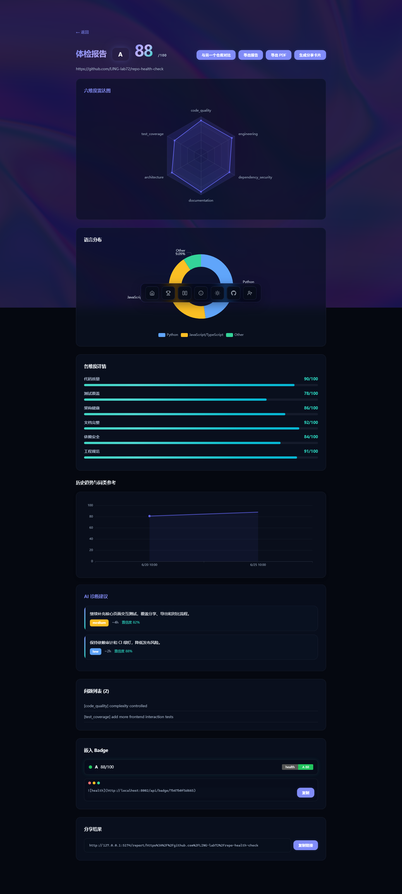
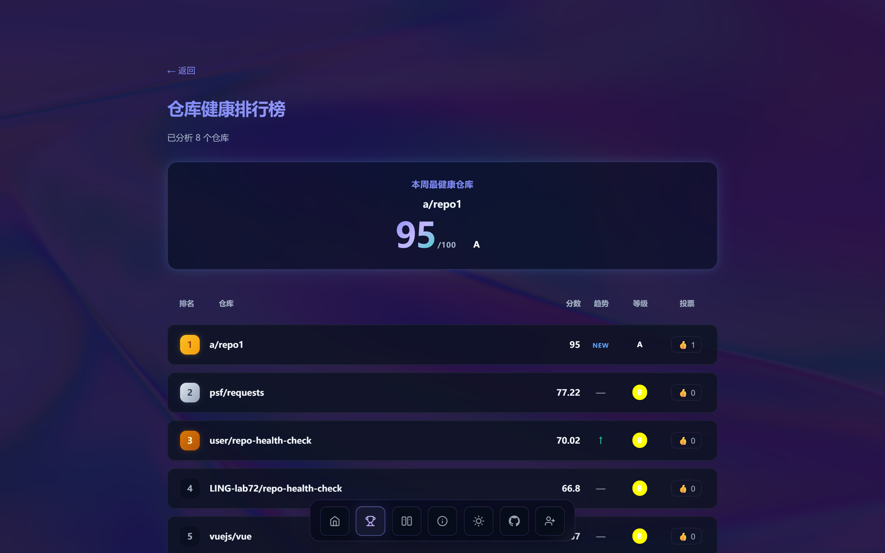
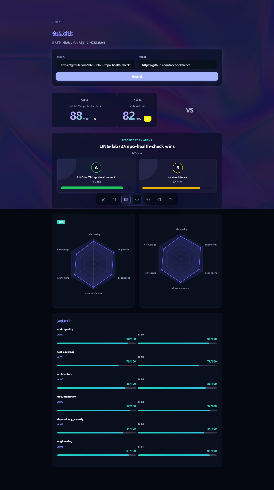
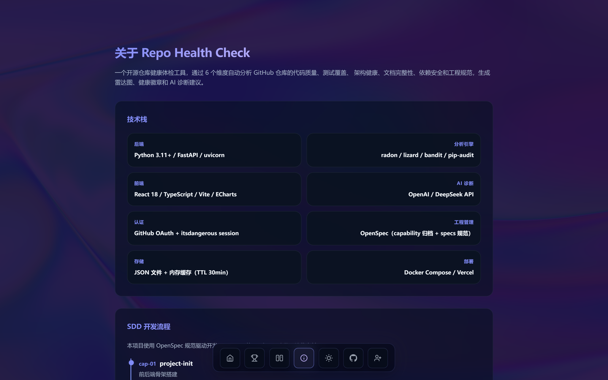

# Repo Health Check

> 一键体检你的 GitHub 仓库 — 6 维分析、雷达图、AI 诊断、健康徽章、排行榜

**中文** | [English](./README_EN.md)

## 特性

- **六维雷达图**：代码质量 / 测试覆盖 / 架构健康 / 文档完整 / 依赖安全 / 工程规范
- **AI 智能诊断**：DeepSeek / OpenAI 驱动，生成 3-5 条针对性改进建议
- **健康徽章**：可嵌入 README 的 shields.io 风格 SVG Badge
- **排行榜**：多仓库横向对比 + 投票 + 趋势标签
- **对比模式**：双仓库并排雷达图对比
- **历史趋势**：折线图展示多次分析的分数变化
- **主题切换**：深色/浅色双主题
- **结果分享**：一键复制分析报告链接
- **报告导出**：可打印的 HTML 报告
- **GitHub OAuth**：登录后支持用户级投票去重
- **智能网络**：直连 → 代理 → 友好提示三级自动降级，国内环境下无需手动配置代理
- **OpenSpec 规范化**：所有变更通过 capability 归档管理，specs 目录持续维护

## 截图预览

### 首页

深色沉浸式界面，Iridescence WebGL 流动背景 + CurvedLoop 弧形滚动标题 + 健康度评分入口。



### 分析报告

六维雷达图 + AI 智能诊断建议 + 健康徽章 + 历史趋势图，毛玻璃卡片设计。



### 排行榜

多仓库健康度横向对比，支持投票和趋势标签。



### 对比模式

双仓库并排雷达图对比，直观展示差异。



### 关于

项目介绍、SDD 开发流程和贡献方式。



## 快速开始

### 环境要求

- Python 3.11+
- Node.js 20+
- Git

### 本地运行

```bash
git clone https://github.com/LING-lab72/repo-health-check
cd repo-health-check

# 后端
pip install -r backend/requirements.txt
uvicorn backend.main:app --host 0.0.0.0 --port 8000 --reload

# 前端（新终端）
cd frontend && npm install && npm run dev
```

#### 国内网络环境

在国内使用时，后端已内置代理自动降级机制：

1. 先尝试直连 GitHub
2. 直连失败时自动检测 `.env` 中配置的 `GIT_HTTP_PROXY`，尝试走代理
3. 代理不可达时给出友好的中文提示

如需手动指定代理，启动时传递环境变量：

```bash
GIT_HTTP_PROXY=http://127.0.0.1:7890 \
  http_proxy=http://127.0.0.1:7890 \
  https_proxy=http://127.0.0.1:7890 \
  uvicorn backend.main:app --host 0.0.0.0 --port 8000
```

也可在 `.env` 中配置 `GIT_HTTP_PROXY=http://127.0.0.1:7890`，后端会自动读取。

### Docker 部署

```bash
docker-compose up -d
# 前端: http://localhost
# 后端: http://localhost:8000
```

### 配置

```bash
cp .env.example .env
# 编辑 .env 填入 API Key、OAuth 凭据和代理地址
```

| 变量 | 说明 | 默认值 |
|------|------|--------|
| `DEEPSEEK_API_KEY` | DeepSeek API Key（推荐） | — |
| `OPENAI_API_KEY` | OpenAI API Key（备用） | — |
| `GIT_HTTP_PROXY` | Git HTTP 代理地址 | `http://127.0.0.1:7890` |
| `GITHUB_CLIENT_ID` | GitHub OAuth Client ID | — |
| `GITHUB_CLIENT_SECRET` | GitHub OAuth Client Secret | — |
| `CORS_ORIGINS` | CORS 允许的来源 | `http://localhost:5173` |
| `SESSION_SECRET` | Session 签名密钥 | — |

## 评分维度

| 维度 | 权重 | 工具 |
|------|------|------|
| 代码质量 | 20% | radon (CC+MI) + ESLint |
| 测试覆盖 | 20% | 测试文件比例 + 框架检测 + lcov 解析 |
| 架构健康 | 15% | God Class + import 耦合 + madge 循环依赖 |
| 文档完整 | 15% | README 质量 + 注释密度 |
| 依赖安全 | 15% | bandit 扫描 + pip-audit |
| 工程规范 | 15% | CI/Linter/License/Git 规范 |

## 项目结构

```
repo-health-check/
├── backend/
│   ├── main.py              # FastAPI 入口
│   ├── routes/              # API 路由（analyze, badge, auth, compare, export, history, leaderboard, vote）
│   ├── analyzer/            # 6 维分析引擎（code_quality, test_coverage, architecture, documentation, dependency_security, engineering）
│   ├── ai/                  # AI 诊断模块（DeepSeek / OpenAI）
│   ├── models/              # 数据模型
│   ├── services/            # 核心服务（clone, cache, storage, session）
│   └── tests/               # pytest 测试
├── frontend/
│   └ src/
│   │  ├── pages/            # 5 页面（Home, Report, Leaderboard, Compare, About）
│   │  ├── components/       # 组件（Navbar, RadarChart, ScoreBar, HistoryChart）
│   │  └── api.ts            # API 调用层
│   └ vite.config.ts
│   └ package.json
├── sdd/                     # SDD 评分规则定义
├── openspec/                # OpenSpec 工程化规范管理
│   ├── project.md           # 项目概述
│   ├── specs/               # 能力域规范定义（9 个）
│   └ changes/archive/       # 已归档 capability（15 个）
├── data/                    # 运行时数据（history.json 等）
├── .env                     # 环境变量配置
├── docker-compose.yml       # Docker 部署
└── README.md
```

## 技术栈

| 层 | 技术 |
|----|------|
| 后端 | Python 3.11+ / FastAPI / uvicorn |
| 分析引擎 | radon / lizard / bandit / pip-audit / ESLint / madge |
| AI 诊断 | OpenAI / DeepSeek API |
| 前端 | React 18 / TypeScript / Vite / ECharts |
| 认证 | GitHub OAuth + itsdangerous session |
| 存储 | JSON 文件 + 内存缓存（TTL 30min） |
| 工程管理 | OpenSpec（capability 归档 + specs 规范） |
| 部署 | Docker Compose |

## 网络与缓存机制

### Git Clone 自动降级

后端 `clone.py` 实现了三级自动降级策略：

1. **直连探测**：先以 `git ls-remote` 测试 GitHub 直连可达性（显式 `-c http.proxy=""` 绕过全局代理配置）
2. **代理回退**：直连失败时，检测 `.env` 或启动环境变量中的 `GIT_HTTP_PROXY`，通过 socket 检测代理端口可达性，再以 `git -c http.proxy=... -c https.proxy=...` flag 方式克隆
3. **友好提示**：代理不可用时返回中文提示而非原始 SSL/TLS 错误

### 缓存策略

- 成功结果缓存 30 分钟，命中后直接返回
- **错误结果不阻塞重新检测**：缓存命中但含 `_error` 字段时，自动 `invalidate()` 清除后重新执行实际检测，确保网络恢复后可正常使用

## OpenSpec 规范化管理

本项目采用 OpenSpec 进行工程化规范化管理：

- `openspec/specs/` — 9 个能力域的持续维护规范定义
- `openspec/changes/archive/` — 15 个已完成 capability 的归档记录

每个 capability 归档包含：proposal（动机与范围）、design（技术决策）、tasks（任务清单）、.openspec.yaml（元数据）、以及受影响的 specs 快照。

### 近期 capability

| ID | 名称 | 说明 |
|----|------|------|
| cap-12 | bugfix-quality | 多处 bug 修复与质量提升 |
| cap-13 | quality-polish | 细节打磨 |
| cap-14 | proxy-auto-degrade-and-cache-fix | 代理自动降级 + 错误缓存不阻塞 |
| cap-15 | curved-loop-hero-title | 首页 CurvedLoop 弧形标题集成 |

## 测试

```bash
pytest backend/tests/ -v          # 后端单元测试
cd frontend && npm test           # 前端测试
```

## 贡献

提交规范遵循 [Conventional Commits](https://www.conventionalcommits.org/)。

```bash
git checkout -b feature/your-feature
git commit -m 'feat: add your feature'
git push origin feature/your-feature
```

查看 About 页面了解 SDD 开发流程和贡献方式。

## License

MIT
