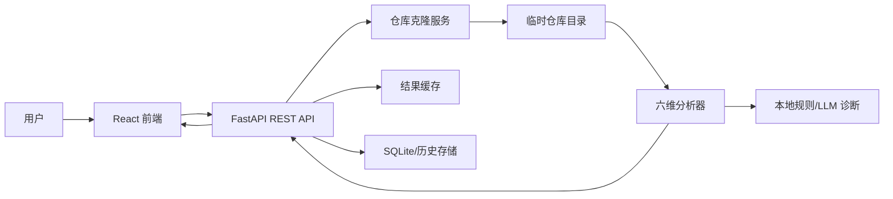
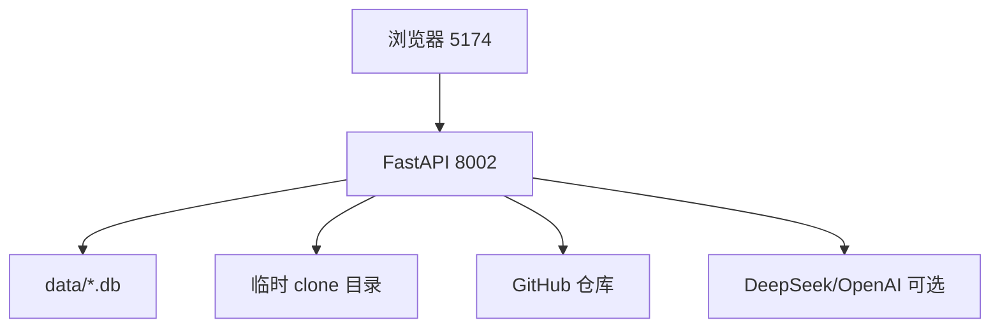

# 概要设计说明书

## 1. 架构目标

系统采用前后端分离架构，目标是：

- 前端负责输入、可视化、交互和导出体验。
- 后端负责克隆仓库、分析、缓存、持久化和 API。
- 分析器按维度插件化，便于扩展。
- 数据层轻量化，适合本地和课程部署。

## 2. 总体架构

## 3. 模块划分

### 3.1 前端模块

| 模块 | 职责 |
| --- | --- |
| HomePage | 输入 GitHub URL、API Key 配置、推荐仓库 |
| ReportPage | 报告展示、进度条、导出、分享、Badge |
| ComparePage | 双仓库对比、PK Arena、海报生成 |
| LeaderboardPage | 排行榜、分页、投票 |
| AboutPage | 项目介绍、capability 轨迹、技术栈 |
| components | RadarChart、ScoreBar、LanguagePieChart、Dock、GlassCard 等 |
| utils | PDF 打印、分享卡片、PK 海报等前端工具 |

### 3.2 后端模块

| 模块 | 职责 |
| --- | --- |
| routes/analyze.py | 分析任务创建、缓存命中、状态轮询 |
| routes/badge.py | SVG Badge 生成 |
| routes/export.py | HTML 报告导出 |
| routes/compare.py | 双仓库并行分析 |
| routes/leaderboard.py | 排行榜查询 |
| routes/vote.py | 投票接口 |
| services/clone.py | Git 仓库克隆、代理降级 |
| services/cache.py | TTL 缓存、深拷贝保护 |
| services/storage.py | 历史记录、投票和持久化 |
| services/session.py | Session 签名密钥 |
| analyzer/ | 六维分析器和聚合器 |
| ai/diagnose.py | LLM/本地规则诊断 |

## 4. 部署视图

## 5. 关键流程

### 5.1 分析流程

1. 用户输入 GitHub URL。
2. 前端调用 `POST /api/analyze`。
3. 后端检查缓存。
4. 缓存命中则直接返回。
5. 未命中则创建异步任务并返回 `task_id`。
6. 前端轮询 `GET /api/analyze/status`。
7. 后端克隆仓库并运行六维分析。
8. 聚合评分、生成 AI 诊断、保存缓存和历史。
9. 前端展示报告。

### 5.2 对比流程

1. 用户输入仓库 A 和仓库 B。
2. 前端校验两个 URL 均合法且不同。
3. 后端并行分析两个仓库。
4. 前端展示总分对比、雷达图、维度差异和 PK Arena。

### 5.3 导出流程

1. 前端通过 hash 获取导出 URL。
2. 后端生成 HTML 报告。
3. 用户可下载 HTML 或用浏览器打印为 PDF。
4. 分享卡片和 PK 海报由前端 Canvas 生成。

## 6. 安全设计

- HTML/SVG 输出统一转义，防止 XSS。
- Session 未配置密钥时拒绝启动。
- OAuth 使用 state 防 CSRF。
- CORS 仅允许配置的前端来源。
- API Key 不写入后端持久化存储。
- 异步任务集合通过锁保护。

## 7. 扩展设计

后续可扩展：

- 接入 PostgreSQL。
- 支持 GitLab/GitLink 仓库。
- 增加 Lighthouse、Issue 响应速度、PR 合并速度等维度。
- 支持组织级仓库批量分析。
- 生成更完整的项目健康度趋势预测。

