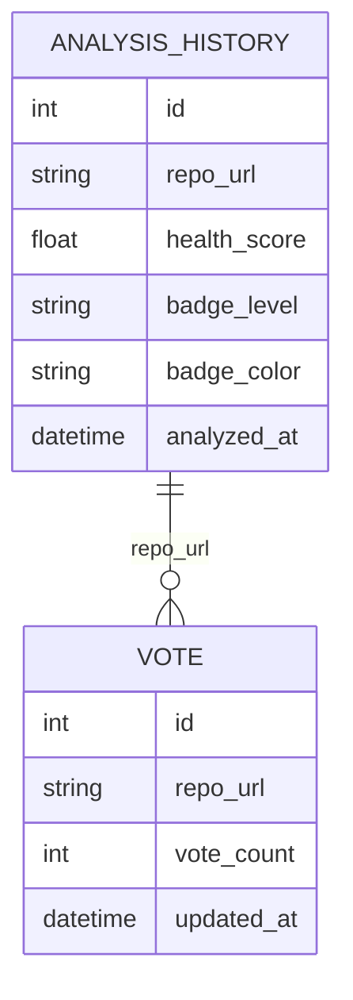

# 数据库设计说明书

## 1. 数据设计目标

Repo Health Check 的持久化数据主要用于：

- 保存仓库历史分析记录。
- 支持排行榜。
- 保存投票数据。
- 支持趋势展示和重复分析对比。

系统优先采用 SQLite，适合本地启动、课程演示和轻量部署。

## 2. 主要实体

### 2.1 AnalysisHistory

表示一次仓库分析摘要。

| 字段 | 类型 | 说明 |
| --- | --- | --- |
| id | integer | 主键 |
| repo_url | text | 规范化后的仓库 URL |
| health_score | real | 健康分 |
| badge_level | text | 等级 |
| badge_color | text | Badge 颜色 |
| analyzed_at | text/datetime | 分析时间 |

### 2.2 Vote

表示用户对仓库的投票统计。

| 字段 | 类型 | 说明 |
| --- | --- | --- |
| id | integer | 主键 |
| repo_url | text | 仓库 URL |
| vote_count | integer | 投票数量 |
| updated_at | text/datetime | 更新时间 |

### 2.3 CacheRecord

当前缓存主要在内存中维护，也可扩展为数据库表。

| 字段 | 类型 | 说明 |
| --- | --- | --- |
| repo_hash | text | 仓库 hash |
| repo_url | text | 仓库 URL |
| result_json | text | 完整分析结果 |
| expires_at | datetime | 过期时间 |

## 3. 数据关系

## 4. 索引设计

| 表 | 索引 | 目的 |
| --- | --- | --- |
| analysis_history | repo_url | 查询单仓库历史趋势 |
| analysis_history | health_score | 排行榜排序 |
| analysis_history | analyzed_at | 获取最新记录 |
| vote | repo_url | 投票查询和更新 |

## 5. 数据生命周期

1. 用户分析仓库后保存历史摘要。
2. 完整报告优先进入缓存。
3. 缓存 30 分钟后过期。
4. 历史记录长期保留，用于排行榜和趋势。
5. 临时 clone 目录在分析结束后删除。

## 6. 一致性策略

- 分析完成后再写入历史记录。
- 排行榜以仓库最新或最高得分记录作为展示依据。
- 投票接口需要防止短时间重复投票。
- 多进程部署时建议使用 SQLite 或 PostgreSQL，避免 JSON 文件并发写问题。

## 7. 后续扩展

- 引入 Alembic 管理数据库迁移。
- 将完整报告结果持久化。
- 增加用户表和用户收藏表。
- 支持组织级仓库批量分析记录。

