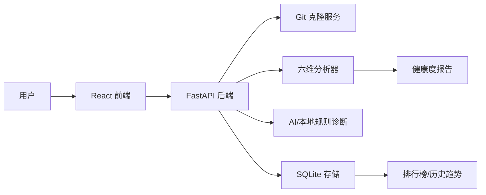
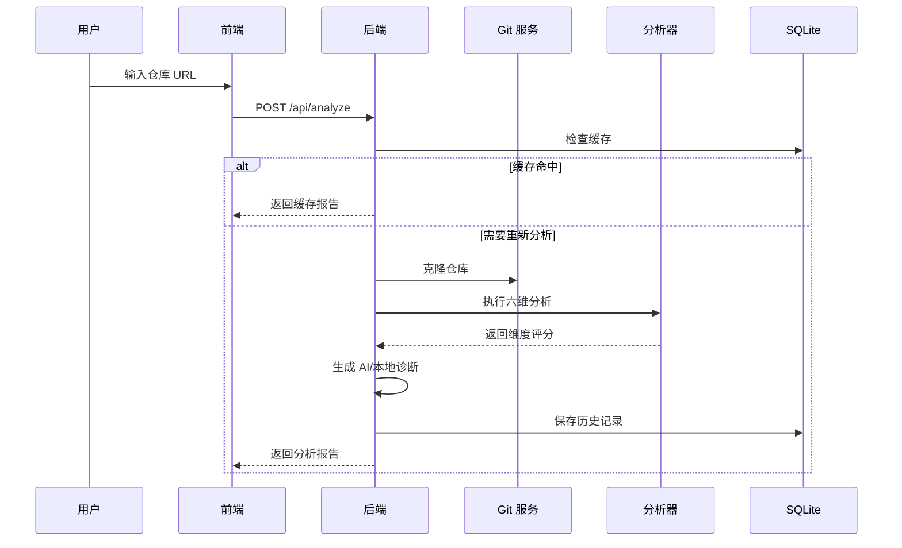

# 从“能跑”到“可评估”：Repo Health Check 的开源仓库健康度分析实践

> 本文介绍 Repo Health Check 的设计思路、核心架构和工程实践。项目目标不是简单地给仓库打一个分，而是把代码质量、测试覆盖、工程规范、依赖安全、文档完整度和社区反馈组织成一份可解释、可导出、可持续迭代的健康度报告。

## 1. 项目背景：开源项目为什么需要“健康度检查”

很多开源项目在 README 里看起来很完整，但真正使用或二次开发时，常常会遇到这些问题：

- 项目能不能快速启动？
- 有没有测试和 CI？
- 代码复杂度是否过高？
- 依赖是否存在安全风险？
- 文档是否足够支撑新用户上手？
- 这个项目近期是否还在维护？

传统方式通常依赖人工 review：打开仓库、翻 README、看目录结构、查 CI 配置、跑测试、检查依赖。这种方式耗时，而且不同评审者的标准不一致。

Repo Health Check 想解决的就是这个问题：输入一个仓库地址，系统自动克隆、分析、评分，并生成一份可视化报告。它既可以帮助开发者快速了解项目状态，也可以用于课程实践、开源项目评估、技术选型和项目答辩。

## 2. 产品定位：面向开发者的仓库健康仪表盘

Repo Health Check 的目标用户主要有三类：

- 开源项目维护者：发现项目短板，持续改进工程质量。
- 课程实践学生：展示项目开发过程、质量指标和工程管理能力。
- 技术选型用户：快速比较多个仓库，判断哪个项目更适合采用。

系统提供的核心能力包括：

- 六维仓库健康分析
- AI 诊断建议
- 可视化报告
- SVG Badge
- 排行榜与投票
- 仓库对比 PK
- HTML/PDF 导出与分享卡片
- GitHub Actions 与 GitLink/Jianmu CI/CD 支持

## 3. 系统架构：FastAPI + React + SQLite 的轻量实现

项目采用前后端分离架构：



后端使用 FastAPI，负责仓库克隆、异步分析、缓存、报告导出和数据持久化。前端使用 React 和 Vite，负责交互体验、报告展示、图表渲染和分享导出。

SQLite 被用作轻量级持久化方案。相比早期的 JSON 文件存储，SQLite 更适合多次分析记录、排行榜分页、投票数据和历史趋势查询，同时不需要额外部署数据库服务。

## 4. 六维分析模型：让评分可解释

项目不是只输出一个总分，而是从六个维度拆解仓库健康状态：

| 维度 | 关注点 |
| --- | --- |
| 代码质量 | 复杂度、可维护性、文件规模、重复风险 |
| 测试覆盖 | 测试文件比例、测试框架、覆盖率配置 |
| 架构健康 | 包结构、模块耦合、God Class、循环依赖 |
| 文档完整度 | README、贡献指南、注释密度、API 说明 |
| 依赖安全 | 依赖清单、安全扫描、锁文件、风险提示 |
| 工程规范 | CI/CD、Lint、Git hygiene、License、配置规范 |

每个维度都由多个子指标组成。分析结果不仅包含分数，还包含 `details` 和 `issues`，用于解释为什么得分高或低。

这种设计有两个好处：

1. 用户不会只看到一个“神秘分数”，而是能知道具体短板在哪里。
2. 后续扩展新指标时，不需要推翻整体架构，只需要新增 analyzer 或子评分规则。

## 5. 后端实现：从 URL 到报告的分析流水线

一次完整分析大致经过以下步骤：



为了提升体验，系统加入了缓存感知策略。用户短时间内重复打开同一个报告时，可以直接使用缓存结果，避免重复克隆和长时间等待。

对比分析也可以并行执行两个仓库的分析任务，使 Compare 页面不再因为串行分析而耗时翻倍。

## 6. AI 诊断：有 Key 用 LLM，无 Key 用本地规则

项目中的 AI 诊断不是强依赖外部模型。它采用双层策略：

- 配置 DeepSeek/OpenAI API Key 时：调用 LLM 生成更自然、更综合的诊断建议。
- 未配置 API Key 时：使用本地规则，根据六维评分和 issues 自动生成基础建议。

这样设计是因为开源项目不能假设所有用户都有 API Key。对于课程答辩或本地演示，无 Key 也能完整跑通流程；对于真实部署，配置 Key 后可以获得更强的分析表达能力。

## 7. 前端体验：不只是表格，而是可演示的报告

前端重点不是堆功能，而是让分析结果“看得懂、讲得清、能分享”。

报告页包含：

- 总分和等级
- 六维雷达图
- 各维度分数条
- 语言分布饼图
- 历史趋势
- AI 诊断建议
- Badge 嵌入预览
- HTML/PDF 导出
- 分享卡片生成

其中雷达图加入了从中心发散的视觉动效，用来强化“健康度扫描”的感受。排行榜页面则通过分数、等级、趋势和点赞数展示项目之间的差异，适合在答辩中说明社区反馈和运营指标。

## 8. 工程化实践：从功能完成到项目可信

为了让项目更像一个真实开源项目，而不是一次性作业，Repo Health Check 补齐了多项工程化内容：

- GitHub Actions CI
- GitLink/Jianmu DevOps 流水线
- 后端 pytest 测试
- 前端 Vitest 测试
- ESLint 和 flake8
- CONTRIBUTING.md
- SECURITY.md
- CHANGELOG.md
- OpenSpec 变更规范
- 一键启动脚本

OpenSpec 被用于记录需求变更和能力演进。相比“想到哪里改到哪里”，这种方式更适合展示软件工程过程：先定义 capability，再拆任务，最后归档变更。

## 9. 安全加固：小项目也要有安全边界

项目中修复和增强了多处安全点：

- SVG Badge 输出转义，避免 XSS。
- HTML 报告动态字段转义，避免脚本注入。
- Session Secret 不再使用生产默认弱密钥。
- OAuth state 校验，避免 CSRF。
- CORS 仅允许配置中的前端来源。
- 异步任务状态使用锁保护，减少竞态风险。

这些点虽然不一定在演示中最显眼，但能体现项目不是只关注页面效果，也考虑了真实部署风险。

## 10. 演示场景：五分钟讲清项目价值

一个推荐的演示流程是：

1. 打开首页，输入仓库地址。
2. 展示分析进度和报告页。
3. 讲解雷达图、分数、AI 诊断和语言分布。
4. 打开排行榜，说明健康度排名、趋势和点赞。
5. 进入 Compare 页面，对比两个仓库。
6. 导出 PDF 或生成分享卡片。
7. 展示 GitHub Issues、CI/CD 和文档，证明项目具备持续维护能力。

推荐演示仓库：

```text
https://github.com/LING-lab72/repo-health-check
https://github.com/vuejs/vue
https://github.com/facebook/react
https://github.com/fastapi/fastapi
```

## 11. 当前不足与后续计划

项目仍有继续优化空间：

- 支持 GitLink、Gitee、GitLab 等更多平台。
- 引入更稳定的 PDF 渲染方案。
- 增加更多真实社区指标，如 Issue 响应时间、PR 合并速度。
- 将历史趋势扩展为同类项目基准对比。
- 增强前端测试覆盖和无障碍体验。
- 将本地规则诊断沉淀为可配置知识库。

这些方向已经可以通过 GitHub Issues 管理，形成持续迭代路线图。

## 12. 总结

Repo Health Check 的核心价值在于把“仓库好不好”这个模糊问题，转化为可以分析、可以解释、可以展示、可以持续改进的工程系统。

它不仅是一个仓库评分工具，也是一次完整的软件工程实践：需求管理、前后端开发、AI 辅助、CI/CD、测试、文档、安全加固、社区运营和演示交付都被纳入项目范围。

对于课程答辩来说，它能展示技术实现；对于开源项目来说，它能帮助维护者发现问题；对于用户来说，它能降低理解一个陌生仓库的成本。

这也是 Repo Health Check 想传达的理念：健康的开源项目，不只是代码能运行，还应该容易理解、容易参与、容易维护。
